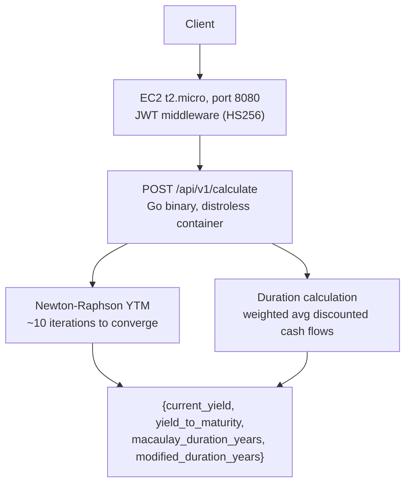

# bondcalc


REST API that computes fixed-income metrics for any bond: yield to maturity via Newton-Raphson, Macaulay and modified duration, and current yield. Written in Go with JWT authentication and deployed to a single free-tier EC2 instance.

Deploy via Terraform to EC2 (see `infra/`). No ALB, no NAT Gateway: the container listens directly on the instance's public IP, which keeps the whole stack inside AWS's 12-month free tier. Spin up locally with `docker compose up`.

## Problem

Bond pricing math is deceptively subtle: YTM has no closed-form solution for most payment schedules, and duration calculations require discounting each cash flow at the solved yield. Finance teams often rely on Excel's YIELD and DURATION functions without understanding the numerical method underneath.

## Solution

A pure-computation Go service. No database, no external dependencies at runtime. YTM solves via Newton-Raphson (converges in ~10 iterations for typical bonds). Duration computes the weighted average time to each discounted cash flow, normalized to years regardless of payment frequency.

## Architecture



The container binds straight to the instance's public IP on port 8080. There's no ALB or TLS termination in front of it, since either one would push the deploy outside the free tier; add an ALB with an ACM certificate if this ever needs to run past demo traffic.

## Tech Stack

| Layer | Technology | Why |
|---|---|---|
| Language | Go 1.23 | Statically compiled binary, ~10MB distroless container, no runtime overhead |
| HTTP | Gin 1.10 | Minimal middleware surface, well-understood performance profile |
| Auth | golang-jwt/jwt v5 | HS256 shared-secret JWT, validated in a single middleware layer |
| Build | Multi-stage Dockerfile | Builder stage compiles; distroless scratch stage ships only the binary |
| Infrastructure | AWS EC2 t2.micro | Free-tier eligible for 12 months; OIDC-based keyless deploys via GitHub Actions + SSM |
| IaC | Terraform 1.9 | GitHub OIDC role, ECR lifecycle policy, S3 remote state |

## Getting Started

```bash
cp .env.example .env
# set JWT_SECRET in .env

go mod tidy
go run ./cmd/server
```

Generate a test JWT (requires Go playground or jwt.io with algorithm HS256):

```json
{
  "sub": "test",
  "exp": 9999999999
}
```

Sign with your `JWT_SECRET`, then:

```bash
curl -X POST http://localhost:8080/api/v1/calculate \
  -H "Authorization: Bearer <your-token>" \
  -H "Content-Type: application/json" \
  -d '{
    "face_value": 1000,
    "annual_coupon_rate": 0.05,
    "coupons_per_year": 2,
    "periods_remaining": 20,
    "price": 950
  }'
```

Response:

```json
{
  "current_yield": 0.052632,
  "yield_to_maturity": 0.054975,
  "macaulay_duration_years": 7.9341,
  "modified_duration_years": 7.7221,
  "coupon_payment": 25.0
}
```

## Running Tests

```bash
go test -v -race ./...
```

18 tests covering: at-par bonds, discount bonds, premium bonds, zero-coupon bonds, all validation error paths, and the relationship invariants (YTM < coupon on premium, Macaulay > Modified).

## Deploy

See [infra/README.md](infra/README.md) for the full Terraform + EC2 deploy runbook.

Required GitHub secrets: `AWS_ROLE_ARN`, `ECR_API_REPO`, `EC2_INSTANCE_ID`, `PRODUCTION_URL`. The JWT signing secret lives in SSM Parameter Store, not in a GitHub secret; the instance reads it directly at container start.

## Known Limitations

- YTM solver assumes non-negative periodic yield; deeply distressed bonds (price near zero) may not converge within 200 iterations.
- Semi-annual convention assumed for all duration math when `coupons_per_year = 2`; quarterly and monthly bonds use the same formula with the appropriate period length.
- JWT is HS256 shared-secret: acceptable for a single-service API, not suitable if multiple independent services need to verify tokens (use RS256 asymmetric keys in that case).
- Rate limiting is absent; add an in-process sliding window before exposing to public traffic beyond a demo.
- No TLS: the API is plain HTTP on port 8080. Adding HTTPS means adding back an ALB with an ACM certificate, which moves the deploy outside the free tier.
- Single EC2 instance with no auto-recovery configured; an instance failure means manual intervention, not automatic failover.

## License

MIT
